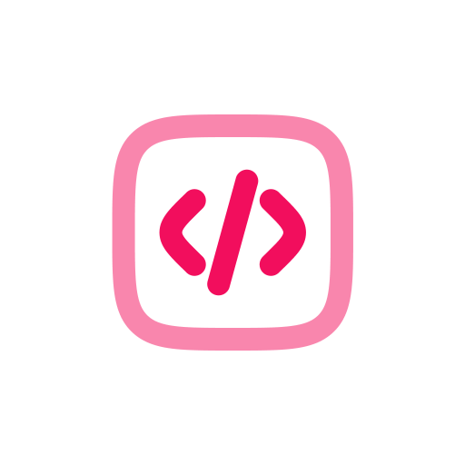

# Alex's Portfolio 🚀

[](https://reactjs.org/)
[](https://www.typescriptlang.org/)
[](https://www.framer.com/motion/)
[]()

> A modern, responsive portfolio website showcasing my work and experience as a Full Stack Developer.



## ✨ Features

- 🎨 Modern, minimalist design
- 🌓 Dark theme with custom accent colors
- 🔄 Smooth page transitions and animations
- 📱 Fully responsive layout
- 💼 Project showcase with live demos
- 🛍️ Store with purchasable products
- 🤝 Client work portfolio
- 📬 Contact information
- 📊 Analytics integration with Swetrix

## 🛠️ Built With

- **Frontend Framework**: React 19.0.0
- **Language**: TypeScript 4.9.5
- **Routing**: React Router DOM 7.2.0
- **Animations**: Framer Motion 12.4.7
- **Analytics**: Swetrix 3.7.0
- **Styling**: Custom CSS with CSS Variables

## 🚀 Getting Started

### Prerequisites

- Node.js (v18 or higher)
- npm

### Installation

1. Clone the repository
```bash
git clone https://github.com/developedbyalex/byalex.gg.git
```

2. Navigate to the project directory
```bash
cd byalex.gg
```

3. Install dependencies
```bash
npm install
```

4. Start the development server
```bash
npm run dev
```

The site will be available at `http://localhost:3000`

## 📦 Project Structure

```
byalex.gg/
├── public/              # Static files and assets
├── src/                 # Source code
│   ├── pages/          # Page components (Home, Work, Store, Contact)
│   ├── components/     # Reusable components
│   ├── styles/         # CSS files
│   ├── App.tsx         # Main app component
│   └── index.tsx       # Entry point
└── package.json        # Dependencies and scripts
```

## 🎨 Customization

The site uses CSS variables for easy customization. Main colors and themes can be modified in `src/App.css`:

```css
:root {
  --text-color: #ffffff;
  --bg-color: #09090b;
  --highlight-color: #ff00bf;
  --highlight-color-dim: rgba(255, 0, 179, 0.6);
  /* ... other variables */
}
```

## 📱 Responsive Design

The site is fully responsive and optimized for:
- 📱 Mobile devices
- 💻 Tablets
- 🖥️ Desktop screens
- 📺 Large displays

## 🚀 Deployment

Build the project for production:
```bash
npm run build
```

The build files will be in the `build/` directory, ready for deployment to your preferred hosting platform.

## 📝 License

All rights reserved © Alex

## 🤝 Contact

- Website: [byalex.gg](https://byalex.gg)
- Discord: [@DevelopedByAlex](https://discord.gg/QWN9ZqJd)
- Twitter: [@ByAlexDotGG](https://x.com/byalexdotgg)
